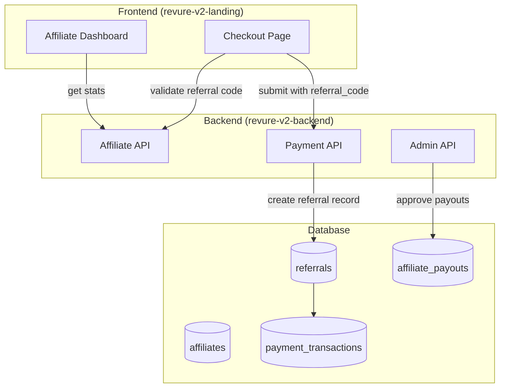

# Affiliate & Referral Program - Phase 1 MVP

## Architecture Overview

```mermaid
flowchart TB
    subgraph Frontend["Frontend (revure-v2-landing)"]
        Checkout[Checkout Page]
        AffiliateDash[Affiliate Dashboard]
    end
    
    subgraph Backend["Backend (revure-v2-backend)"]
        AffiliateAPI[Affiliate API]
        PaymentAPI[Payment API]
        AdminAPI[Admin API]
    end
    
    subgraph Database["Database"]
        Affiliates[(affiliates)]
        Referrals[(referrals)]
        Payouts[(affiliate_payouts)]
        PaymentTx[(payment_transactions)]
    end
    
    Checkout -->|validate referral code| AffiliateAPI
    Checkout -->|submit with referral_code| PaymentAPI
    PaymentAPI -->|create referral record| Referrals
    AffiliateDash -->|get stats| AffiliateAPI
    AdminAPI -->|approve payouts| Payouts
    Referrals --> PaymentTx


```