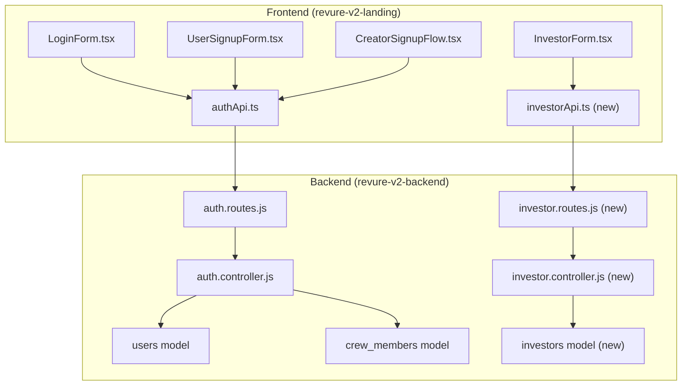

# Auth & Investor API Integration Plan

## Summary

The backend already has comprehensive auth APIs including multi-step creator registration. The frontend needs to be updated to properly integrate with these APIs, and a new investor API endpoint needs to be created.

---

## Architecture Overview



---

## Backend Changes

### 1. Create Investor Model & Migration

**New File:** [`src/models/investors.js`](revure-v2-backend/src/models/investors.js)

```javascript
// Fields: id, first_name, last_name, email, phone_number, country, 
// investment_rounds, investment_timing, investment_amount, status, created_at
```

**New File:** [`migrations/create_investors_table.sql`](revure-v2-backend/migrations/create_investors_table.sql)

### 2. Create Investor Controller

**New File:** [`src/controllers/investor.controller.js`](revure-v2-backend/src/controllers/investor.controller.js)

- `submitInvestorInterest` - POST endpoint to submit investor form
- `getInvestors` - GET endpoint for admin to view all investor submissions
- `updateInvestorStatus` - PATCH endpoint to update investor status

### 3. Create Investor Routes

**New File:** [`src/routes/investor.routes.js`](revure-v2-backend/src/routes/investor.routes.js)

- `POST /investors` - Public, submit investor interest
- `GET /investors` - Admin only, list all investors
- `PATCH /investors/:id/status` - Admin only, update status

### 4. Register Investor Routes

**Modify:** [`src/routes/index.js`](revure-v2-backend/src/routes/index.js)

Add: `router.use('/investors', require('./investor.routes'));`

---

## Frontend Changes

### 1. Update Auth Types

**Modify:** [`lib/types.ts`](revure-v2-landing/lib/types.ts)

- Update `User` interface to match actual backend response (id, userTypeId, userRole, crew_member_id)
- Add `CreatorRegistrationStep1Data`, `CreatorRegistrationStep2Data`, `CreatorRegistrationStep3Data` types
- Add `InvestorData` type
- Update `RegisterData` to include `userType` (number: 1=client, 2=creator)

### 2. Update Auth API

**Modify:** [`lib/redux/features/auth/authApi.ts`](revure-v2-landing/lib/redux/features/auth/authApi.ts)

- Fix `transformResponse` to handle actual backend response format (success/message/user/token structure)
- Add `verifyEmail` mutation
- Add `registerCreatorStep1`, `registerCreatorStep2`, `registerCreatorStep3` mutations
- Add `forgotPassword`, `resetPassword` mutations

### 3. Create Investor API

**New File:** [`lib/redux/features/investors/investorApi.ts`](revure-v2-landing/lib/redux/features/investors/investorApi.ts)

- `submitInvestorInterest` mutation

### 4. Update Login Form

**Modify:** [`components/auth/LoginForm.tsx`](revure-v2-landing/components/auth/LoginForm.tsx)

- Add toast notifications for success/error
- Add redirect to dashboard/home after successful login
- Handle API error responses properly

### 5. Update User Signup Form

**Modify:** [`components/auth/UserSignupForm.tsx`](revure-v2-landing/components/auth/UserSignupForm.tsx)

- Update to send `userType: 1` (client)
- Map `phone` field to `phone_number`
- Redirect to email verification after success

### 6. Update Creator Signup Flow

**Modify:** [`components/auth/CreatorSignupFlow.tsx`](revure-v2-landing/components/auth/CreatorSignupFlow.tsx) and step components

- **Step0 (Basic Info):** Call `registerCreatorStep1` API
- **Verify Email:** Call `verifyEmail` API with static code "123456" (dev)
- **Step1 (Specialties):** Collect data, store in state
- **Step2 (Experience):** Collect data, call `registerCreatorStep2` API with combined step1+step2 data
- **Step3 (Profile):** Call `registerCreatorStep3` API

### 7. Integrate Investor Form

**Modify:** [`components/investors/InvestorForm.tsx`](revure-v2-landing/components/investors/InvestorForm.tsx)

- Connect to new investor API endpoint
- Add loading/error states
- Add success toast notification

---

## API Field Mappings

### Login (Frontend to Backend)

| Frontend | Backend |

|----------|---------|

| email | email |

| password | password |

### User Registration (Frontend to Backend)

| Frontend | Backend |

|----------|---------|

| name | name |

| email | email |

| phone | phone_number |

| password | password |

| (hardcoded) | userType: 1 |

### Creator Registration Step 1 (Frontend to Backend)

| Frontend | Backend |

|----------|---------|

| name | first_name + last_name |

| email | email |

| phone | phone_number |

| password | password |

### Creator Registration Step 2 (Frontend to Backend)

| Frontend | Backend |

|----------|---------|

| crew_member_id | crew_member_id |

| specialties | skills (JSON) |

| experience | years_of_experience |

| equipment | equipment_ownership (JSON) |

### Creator Registration Step 3 (Frontend to Backend)

| Frontend | Backend |

|----------|---------|

| portfolioLink | social_media_links.portfolio |

| hourlyRate | hourly_rate |

### Investor (Frontend to Backend - New API)

| Frontend | Backend |

|----------|---------|

| firstName | first_name |

| lastName | last_name |

| email | email |

| phoneNumber | phone_number |

| country | country |

| investmentRounds | investment_rounds |

| investmentTiming | investment_timing |

| investmentAmount | investment_amount |

---

## Implementation Order

1. Backend: Create investor model, migration, controller, routes
2. Frontend: Update types to match backend responses
3. Frontend: Update authApi.ts with correct response transformations
4. Frontend: Create investorApi.ts
5. Frontend: Update LoginForm with proper integration
6. Frontend: Update UserSignupForm with proper integration
7. Frontend: Update CreatorSignupFlow with step-by-step API calls
8. Frontend: Update InvestorForm with API integration
9. Test all flows end-to-end