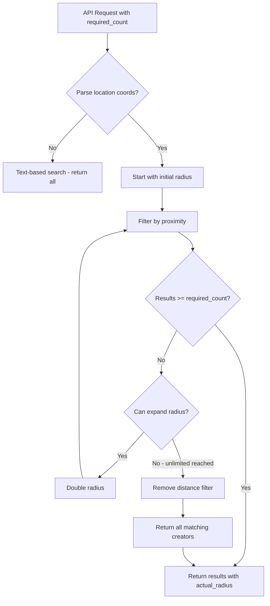

# Auto-Expand Search Radius for Crew Size

## Overview

When the search returns fewer creators than the requested crew size, the backend will automatically expand the search radius progressively until enough creators are found or all creators are searched.

## Architecture



## Backend Changes

### 1. Update Search API ([creators.controller.js](revure-v2-backend/src/controllers/creators.controller.js))

Add new parameter and expansion logic:
- Accept `required_count` parameter (defaults to 1)
- Progressive radius expansion: 25mi → 50mi → 100mi → 200mi → 500mi → 1000mi → unlimited
- Return `actual_radius` in response metadata to show how far the search expanded

```javascript
// Example expansion logic pseudocode:
const RADIUS_STEPS = [25, 50, 100, 200, 500, 1000];

let currentResults = filterByProximity(creators, location, initialRadius);
let stepIndex = RADIUS_STEPS.indexOf(initialRadius);

while (currentResults.length < requiredCount && stepIndex < RADIUS_STEPS.length) {
  stepIndex++;
  currentResults = filterByProximity(creators, location, RADIUS_STEPS[stepIndex]);
}

if (currentResults.length < requiredCount) {
  // No radius limit - include all creators
  currentResults = creators;
}
```

### 2. Update Response Structure

Add metadata to show the effective search radius:

```javascript
{
  success: true,
  data: {
    data: transformedCreators,
    pagination: { ... },
    searchMeta: {
      requestedCount: requiredCount,
      foundCount: finalCount,
      initialRadius: maxDistance,
      actualRadius: effectiveRadius, // null if unlimited
      radiusExpanded: effectiveRadius > maxDistance
    }
  }
}
```

## Frontend Changes

### 3. Update Search Params Type ([lib/types.ts](revure-v2-landing/lib/types.ts))

Add `required_count` to `CreatorSearchParams` interface.

### 4. Update Search Results Page ([app/search-results/page.tsx](revure-v2-landing/app/search-results/page.tsx))

Pass `crew_size` from Redux state (or URL params) to the search API as `required_count`.

### 5. Optional: Show Radius Expansion Notice

If the search expanded beyond the initial radius, optionally display a notice like "Showing creators within 200 miles (expanded from 50 miles to find more matches)"

## Todos