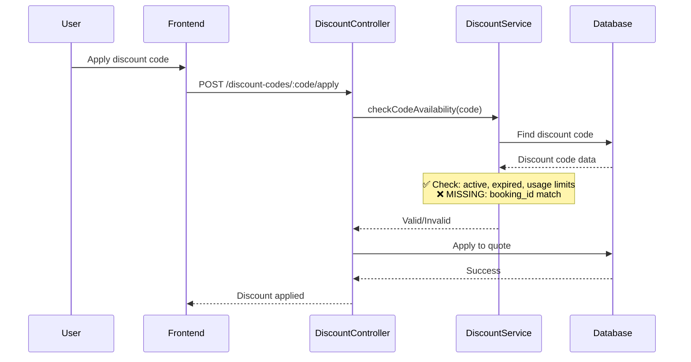
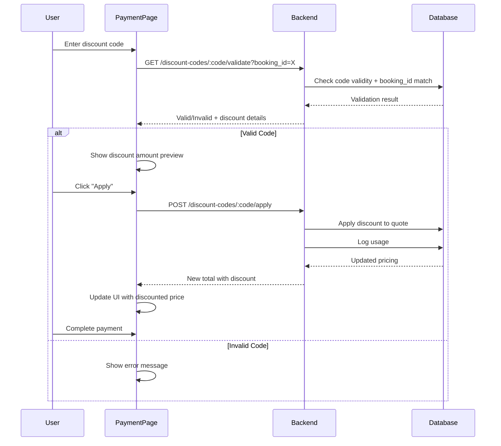

# Discount Code Booking ID Validation

## Problem

Currently, discount codes have a `booking_id` field but lack validation to ensure they're only used for the specific booking they were generated for. This creates a security vulnerability where users could apply discounts intended for one booking to completely different bookings.

## Current Flow



## Solution

Add booking_id validation at two critical points in the discount application flow.

### Files to Modify

1. **[src/services/discount.service.js](src/services/discount.service.js)** - Core validation logic
2. **[src/controllers/discounts.controller.js](src/controllers/discounts.controller.js)** - Apply discount endpoint
3. **[src/controllers/payment-links.controller.js](src/controllers/payment-links.controller.js)** - Payment link flow (optional enhancement)

## Implementation Details

### 1. Update `checkCodeAvailability` Function

Modify the `checkCodeAvailability` function in [src/services/discount.service.js](src/services/discount.service.js) (lines 62-97) to accept an optional `booking_id` parameter and validate it:

```javascript
async function checkCodeAvailability(code, bookingId = null) {
  // ... existing validations ...

  // NEW: Check if discount is restricted to a specific booking
  if (
    discountCode.booking_id &&
    bookingId &&
    discountCode.booking_id !== bookingId
  ) {
    return {
      valid: false,
      reason: "This discount code is not valid for this booking",
    };
  }

  return { valid: true, discountCode };
}
```

**Key Logic:**

- If `discountCode.booking_id` is NULL, the discount can be used for any booking (general discount)
- If `discountCode.booking_id` has a value AND `bookingId` is provided, they must match
- This maintains backward compatibility for general-purpose discount codes

### 2. Update `applyDiscountCode` Controller

Modify [src/controllers/discounts.controller.js](src/controllers/discounts.controller.js) (lines 171-293) to pass `booking_id` to validation:

Current code (line 187):

```javascript
const result = await discountService.checkCodeAvailability(code.toUpperCase());
```

Updated code:

```javascript
const result = await discountService.checkCodeAvailability(
  code.toUpperCase(),
  booking_id,
);
```

**Additional Enhancement:**
Extract `booking_id` from the quote if not provided in request body. After fetching the quote (line 200), add:

```javascript
// If booking_id not provided but quote has one, use it
const effectiveBookingId = booking_id || quote.booking_id;

// Validate with booking_id
const result = await discountService.checkCodeAvailability(
  code.toUpperCase(),
  effectiveBookingId,
);
```

### 3. Update `validateDiscountCode` Controller (Optional)

For the validation endpoint in [src/controllers/discounts.controller.js](src/controllers/discounts.controller.js) (lines 119-165), consider accepting an optional `booking_id` query parameter:

```javascript
const { code } = req.params;
const { booking_id } = req.query; // Optional query param

const result = await discountService.checkCodeAvailability(
  code.toUpperCase(),
  booking_id ? parseInt(booking_id) : null,
);
```

This allows frontend to pre-validate before applying.

### 4. Handle Payment Link Flow

In [src/controllers/payment-links.controller.js](src/controllers/payment-links.controller.js), when creating payment links with discount codes (lines 9-118), the system already links `discount_code_id` to `booking_id`. The validation added in step 1-2 will automatically protect this flow when the discount is applied.

## Testing Scenarios

After implementation, test these scenarios:

1. **General Discount (booking_id = NULL):**

- Should work for any booking ✅

1. **Booking-Specific Discount (booking_id = 123):**

- Applied to booking 123 → Should succeed ✅
- Applied to booking 456 → Should fail with "not valid for this booking" ❌

1. **Payment Link Discount:**

- Discount generated for booking A via payment link
- User tries to manually apply same code to booking B → Should fail ❌

1. **Quote Application:**

- Quote doesn't have booking_id → Should still work (backward compatibility) ✅
- Quote has booking_id → Validation enforced ✅

## Error Messages

Use clear, user-friendly error messages:

- "This discount code is not valid for this booking"
- NOT: "booking_id mismatch" or technical jargon

## Database Schema

No database changes required. The `discount_codes` table already has the `booking_id` column (nullable).

## Backward Compatibility

This change is backward compatible:

- Existing discount codes with `booking_id = NULL` continue working for any booking
- Only discount codes with a specific `booking_id` get the new validation
- API signature change is additive (optional parameter)

## Frontend Integration - Discount Code UI

### Problem

Sales representatives can generate discount codes, but there's currently NO way for users to apply these codes on the payment page. The payment page only has a referral code input, not a discount code input.

### 5. Add Discount Code Input to Payment Page

Modify [app/search-results/payment/page.tsx](app/search-results/payment/page.tsx) to add discount code functionality:

**Location:** Inside the `StripePaymentFormMulti` component, add state and UI similar to the existing referral code pattern (lines 72-237).

#### Add State (after referral code state around line 76):

```typescript
// Discount code state
const [discountCode, setDiscountCode] = useState("");
const [discountValid, setDiscountValid] = useState<boolean | null>(null);
const [discountData, setDiscountData] = useState<any>(null);
const [isValidatingDiscount, setIsValidatingDiscount] = useState(false);
const [appliedDiscount, setAppliedDiscount] = useState<any>(null);
```

#### Add Validation Function:

```typescript
// Debounced discount code validation
const validateDiscountCode = React.useCallback(
  debounce(async (code: string) => {
    if (!code || code.length < 4) {
      setDiscountValid(null);
      setDiscountData(null);
      return;
    }

    setIsValidatingDiscount(true);
    try {
      const API_BASE_URL =
        (
          process.env.NEXT_PUBLIC_API_ENDPOINT ||
          "https://revure-api.beige.app/v1/"
        ).replace(/\/$/, "") + "/";

      // Pass booking_id in query param for validation
      const response = await axios.get(
        `${API_BASE_URL}sales/discount-codes/${code}/validate?booking_id=${shootId}`,
      );

      if (response.data.valid) {
        setDiscountValid(true);
        setDiscountData(response.data.data);
      } else {
        setDiscountValid(false);
        setDiscountData(null);
      }
    } catch (error: any) {
      console.error("Error validating discount code:", error);
      setDiscountValid(false);
      setDiscountData(null);
    } finally {
      setIsValidatingDiscount(false);
    }
  }, 500),
  [shootId],
);
```

#### Add Apply Function:

```typescript
const applyDiscountCode = async () => {
  if (!discountCode || !discountValid || !quote?.quote_id) return;

  try {
    const API_BASE_URL =
      (
        process.env.NEXT_PUBLIC_API_ENDPOINT ||
        "https://revure-api.beige.app/v1/"
      ).replace(/\/$/, "") + "/";

    const response = await axios.post(
      `${API_BASE_URL}sales/discount-codes/${discountCode}/apply`,
      {
        quote_id: quote.quote_id,
        booking_id: shootId,
        guest_email: booking.guest_email,
      },
    );

    if (response.data.success) {
      setAppliedDiscount(response.data.data);
      toast.success("Discount applied successfully!");

      // Refresh payment details to show updated pricing
      // You may need to trigger a re-fetch or update local state
    }
  } catch (error: any) {
    console.error("Error applying discount:", error);
    toast.error(error.response?.data?.message || "Failed to apply discount");
  }
};
```

#### Add UI Component (after referral code input around line 237):

```typescript
{/* Discount Code */}
<div className="relative w-full">
  <label className="absolute -top-3 left-4 bg-[#272626] px-2 text-sm lg:text-base text-white/60 z-10 flex items-center gap-1">
    <Tag className="w-3 h-3" />
    Discount Code (Optional)
  </label>
  <div className="relative">
    <input
      type="text"
      value={discountCode}
      onChange={(e) => {
        const upperCode = e.target.value.toUpperCase().replace(/[^A-Z0-9]/g, '');
        setDiscountCode(upperCode);
        validateDiscountCode(upperCode);
      }}
      className={`h-14 lg:h-[82px] w-full rounded-[12px] border px-4 pr-24 text-white outline-none bg-[#272626] uppercase tracking-wider ${
        discountValid === true
          ? 'border-green-500 focus:border-green-400'
          : discountValid === false
            ? 'border-red-500 focus:border-red-400'
            : 'border-white/30 focus:border-white/50'
      }`}
      placeholder="Enter discount code"
      maxLength={20}
      disabled={!!appliedDiscount}
    />
    <div className="absolute right-4 top-1/2 -translate-y-1/2 flex items-center gap-2">
      {isValidatingDiscount ? (
        <Loader2 className="w-5 h-5 text-white/50 animate-spin" />
      ) : discountValid === true && !appliedDiscount ? (
        <button
          onClick={applyDiscountCode}
          className="text-xs bg-green-500 hover:bg-green-600 text-white px-3 py-1 rounded"
        >
          Apply
        </button>
      ) : discountValid === true && appliedDiscount ? (
        <Check className="w-5 h-5 text-green-500" />
      ) : discountValid === false ? (
        <X className="w-5 h-5 text-red-500" />
      ) : null}
    </div>
  </div>
  {discountValid === true && discountData && !appliedDiscount && (
    <p className="text-green-400 text-sm mt-2 flex items-center gap-1">
      <Check className="w-4 h-4" />
      {discountData.discount_type === 'percentage'
        ? `${discountData.discount_value}% off`
        : `$${discountData.discount_value} off`}
    </p>
  )}
  {appliedDiscount && (
    <p className="text-green-400 text-sm mt-2 flex items-center gap-1">
      <Check className="w-4 h-4" />
      Discount applied: Save ${appliedDiscount.discount_amount.toFixed(2)}
    </p>
  )}
  {discountValid === false && discountCode.length >= 4 && (
    <p className="text-red-400 text-sm mt-2 flex items-center gap-1">
      <X className="w-4 h-4" />
      Invalid or expired discount code
    </p>
  )}
</div>
```

#### Update Price Display in Summary

Update the pricing breakdown section (around line 615-630) to show discount if applied:

```typescript
<div className="flex justify-between mb-3">
  <span className="text-[#626467]">Subtotal</span>
  <span className="font-medium">${quote.subtotal?.toFixed(2) || '0.00'}</span>
</div>
{appliedDiscount && (
  <div className="flex justify-between mb-3 text-green-600">
    <span>Discount Applied</span>
    <span>-${appliedDiscount.discount_amount.toFixed(2)}</span>
  </div>
)}
```

Update the total line:

```typescript
<span className="text-xl font-bold">
  ${appliedDiscount
    ? appliedDiscount.final_total.toFixed(2)
    : quote.subtotal?.toFixed(2) || '0.00'}
</span>
```

### 6. Update Frontend API Types

Add discount code types to [types/sales.ts](types/sales.ts):

```typescript
export interface ApplyDiscountCodeRequest {
  quote_id: number;
  booking_id?: number;
  user_id?: number;
  guest_email?: string;
}

export interface DiscountCodeValidation {
  valid: boolean;
  data?: {
    discount_code_id: number;
    code: string;
    discount_type: "percentage" | "fixed_amount";
    discount_value: number;
    usage_type: string;
    current_uses: number;
    max_uses: number | null;
    expires_at: string | null;
  };
  message?: string;
}
```

### User Flow


