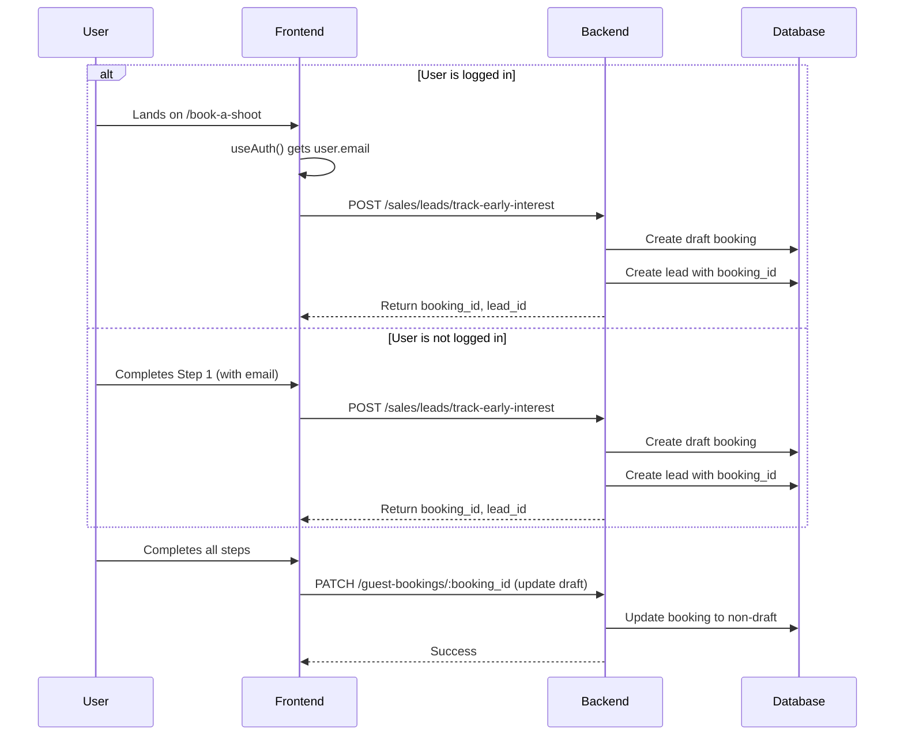
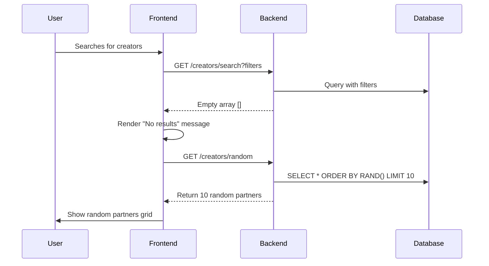

# Book a Shoot V3 Lead Generation & Random Partners

## Overview

This plan covers two distinct features:

1. **Early Lead Generation**: Generate leads when users land on/complete Step 1 of Book a Shoot v3, with email field on first page
2. **Random Partners Fallback**: Show 5-10 random partners when search returns no results

---

## Feature 1: Early Lead Generation in Book a Shoot V3

### Problem Statement

Currently, leads are not generated until the booking is fully completed. We need to track user interest earlier in the funnel by:

- Generating a lead when logged-in users land on the booking page
- Generating a lead when non-logged-in users complete Step 1
- Collecting email on Step 1 (auto-filled if logged in, but editable)

### Backend Changes

**Branch:** `feature/early-lead-generation`

#### 1. Modify Guest Booking Controller

[`/Users/amrik/Documents/revure/revure-v2-backend/src/controllers/guest-booking.controller.js`]

Update the `createGuestBooking` endpoint to support draft bookings:

- Add `is_draft: true` parameter support
- Allow minimal data for draft bookings (content_type, guest_email, optional user_id)
- Return `booking_id` for lead tracking

#### 2. Create New Lead Tracking Endpoint

[`/Users/amrik/Documents/revure/revure-v2-backend/src/controllers/sales-leads.controller.js`]

Add new function `trackEarlyBookingInterest`:

- Accept: `guest_email`, `user_id` (optional), `content_type`, `shoot_type`
- Create draft booking with minimal data
- Call existing `trackBookingStart` with the new booking_id
- Return lead_id and booking_id

#### 3. Add Route

[`/Users/amrik/Documents/revure/revure-v2-backend/src/routes/sales.routes.js`]

Add route:

```javascript
router.post(
  "/leads/track-early-interest",
  salesLeadsController.trackEarlyBookingInterest,
);
```

### Frontend Changes

**Branch:** `feature/early-lead-generation`

#### 1. Add Email Field to Step 1 Component

[`/Users/amrik/Documents/revure/revure-v2-landing/components/book-a-shoot/v3/V3Step1ChooseService.tsx`]

Add email field after the content type section:

- Input field with label "Email Address "
- Auto-fill with `user?.email` from `useAuth()` if logged in
- Keep field editable even when auto-filled
- Add to validation in `validate()` function
- Store in `data.email`

Update the `BookingDataV3` type to include email at Step 1.

#### 2. Update Types

[`/Users/amrik/Documents/revure/revure-v2-landing/components/book-a-shoot/v3/types.ts`]

The type already includes email field, no changes needed. Just ensure it's filled in Step 1 instead of Step 6.

#### 3. Create API Client for Early Lead Tracking

[`/Users/amrik/Documents/revure/revure-v2-landing/lib/redux/features/sales/salesApi.ts`]

Add new endpoint:

```typescript
trackEarlyInterest: builder.mutation({
  query: (data) => ({
    url: "/sales/leads/track-early-interest",
    method: "POST",
    body: data,
  }),
});
```

#### 4. Update Main V3 Component

[`/Users/amrik/Documents/revure/revure-v2-landing/components/book-a-shoot/v3/BookAShootV3.tsx`]

Add lead generation logic:

**On component mount (if logged in):**

- Use `useAuth()` to get user info
- If `isAuthenticated`, call `trackEarlyInterest` with user email immediately
- Store returned `booking_id` and `lead_id` in component state

**On Step 1 completion (if not logged in):**

- In `nextStep()`, when transitioning from step 1 to 2
- Check if lead not already created
- Call `trackEarlyInterest` with `formData.email` and collected data
- Store returned `booking_id` and `lead_id` in component state

**On final booking submission:**

- Update the existing draft booking instead of creating new one
- Include the stored `booking_id` in the booking update call

#### 5. Remove Email from Step 6

[`/Users/amrik/Documents/revure/revure-v2-landing/components/book-a-shoot/v3/V3Step4BookConfirm.tsx`]

Since email is now collected in Step 1:

- Remove email input field (keep only name and phone)
- Use `data.email` from formData (already collected in Step 1)

---

## Feature 2: Random Partners Fallback

### Problem Statement

When search returns no matching creative partners, show "no results" message followed by a section with 5-10 random partners to help users discover alternatives.

### Backend Changes

**Branch:** `feature/random-partners-fallback`

#### 1. Add Random Partners Endpoint

[`/Users/amrik/Documents/revure/revure-v2-backend/src/controllers/creators.controller.js`]

Add new function `getRandomCreators`:

- Query: Get 10 random active, non-draft crew members
- Use SQL: `ORDER BY RAND() LIMIT 10`
- Filter: `is_active = 1 AND is_draft = 0`
- Include same relations as search (profile images, reviews)
- Return in same format as search endpoint

#### 2. Add Route

[`/Users/amrik/Documents/revure/revure-v2-backend/src/routes/creators.routes.js`]

Add route:

```javascript
router.get("/random", creatorsController.getRandomCreators);
```

### Frontend Changes

**Branch:** `feature/random-partners-fallback`

#### 1. Add API Endpoint

[`/Users/amrik/Documents/revure/revure-v2-landing/lib/redux/features/creators/creatorsApi.ts`]

Add new query:

```typescript
getRandomCreators: builder.query({
  query: () => "/creators/random",
});
```

#### 2. Create Random Partners Component

[`/Users/amrik/Documents/revure/revure-v2-landing/app/search-results/components/RandomPartnersSection.tsx`]

New component:

- Section heading: "Discover Other Available Partners"
- Subheading: "Explore creative partners from different locations"
- Grid layout (similar to SimilarCreatorsSection)
- Reuse `CreatorCard` component
- Pass through `shootId` prop for booking flow

#### 3. Update Search Results Page

[`/Users/amrik/Documents/revure/revure-v2-landing/app/search-results/page.tsx`]

Modify the empty state handling (lines 166-175):

Instead of just showing the "no results" message, add:

```tsx
if (matchedCreators.length === 0) {
  return (
    <>
      {/* Existing "No results" message */}
      <div className="pt-32 pb-12 flex items-center justify-center">
        <div className="text-center max-w-md">
          <p className="text-white text-lg mb-4">
            No creators found matching your criteria.
          </p>
          <p className="text-gray-400">
            Try adjusting your budget, location, or content type filters.
          </p>
        </div>
      </div>

      {/* New: Random Partners Section */}
      <Separator />
      <RandomPartnersSection shootId={shootId} />
    </>
  );
}
```

Use `useGetRandomCreatorsQuery()` hook inside the new component to fetch random partners.

---

## Implementation Flow

### Feature 1 - Early Lead Generation



### Feature 2 - Random Partners



---

## Database Changes

### Feature 1: No schema changes needed

- Existing `stream_project_booking` table supports `is_draft` flag
- Existing `sales_leads` table has all required fields

### Feature 2: No changes needed

- Uses existing `crew_members` table

---

## Testing Checklist

### Feature 1 - Lead Generation

- Logged-in user lands on page → lead created immediately
- Email field auto-filled with user email if logged in
- Email field is editable even when auto-filled
- Non-logged-in user completes Step 1 → lead created
- Lead not duplicated if user goes back/forward
- Final booking updates the draft instead of creating new one
- Email validation works on Step 1
- Step 6 no longer shows email field

### Feature 2 - Random Partners

- Search with no results shows "no results" message
- Random partners section appears below message
- 5-10 partners displayed
- Partners are truly random (refresh shows different ones)
- Partner cards clickable and functional
- Works with existing booking flow (shootId passed correctly)

---

## Files Modified Summary

### Backend Files

**Feature 1:**

- `/Users/amrik/Documents/revure/revure-v2-backend/src/controllers/sales-leads.controller.js` (new function)
- `/Users/amrik/Documents/revure/revure-v2-backend/src/controllers/guest-booking.controller.js` (modify)
- `/Users/amrik/Documents/revure/revure-v2-backend/src/routes/sales.routes.js` (new route)

**Feature 2:**

- `/Users/amrik/Documents/revure/revure-v2-backend/src/controllers/creators.controller.js` (new function)
- `/Users/amrik/Documents/revure/revure-v2-backend/src/routes/creators.routes.js` (new route)

### Frontend Files

**Feature 1:**

- `/Users/amrik/Documents/revure/revure-v2-landing/components/book-a-shoot/v3/V3Step1ChooseService.tsx` (add email field)
- `/Users/amrik/Documents/revure/revure-v2-landing/components/book-a-shoot/v3/BookAShootV3.tsx` (lead tracking logic)
- `/Users/amrik/Documents/revure/revure-v2-landing/components/book-a-shoot/v3/V3Step4BookConfirm.tsx` (remove email field)
- `/Users/amrik/Documents/revure/revure-v2-landing/lib/redux/features/sales/salesApi.ts` (new endpoint)

**Feature 2:**

- `/Users/amrik/Documents/revure/revure-v2-landing/app/search-results/page.tsx` (modify empty state)
- `/Users/amrik/Documents/revure/revure-v2-landing/app/search-results/components/RandomPartnersSection.tsx` (new component)
- `/Users/amrik/Documents/revure/revure-v2-landing/lib/redux/features/creators/creatorsApi.ts` (new endpoint)

---

## Git Branch Strategy

Create two feature branches from main:

1. `feature/early-lead-generation` (in both repos)
2. `feature/random-partners-fallback` (in both repos)

Each feature can be developed, tested, and merged independently.
