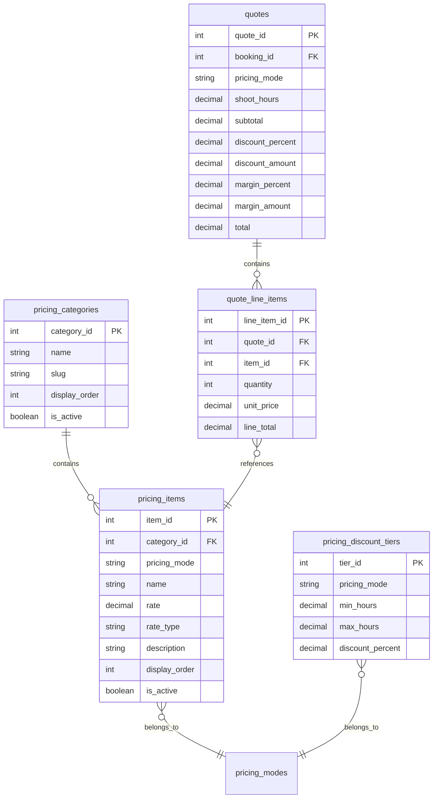

# New Pricing System Implementation

## Overview

Replace the current simple pricing model with a comprehensive catalog-based system that supports:

- Two pricing modes: **General/Commercial** and **Wedding** (auto-selected by event type)
- Hours-based discount tiers (0-30%)
- Multiple service categories with individual line items
- Interactive quote builder with live totals

---

## Database Schema

Create new tables in the backend to store pricing data:



**Key Tables:**| Table | Purpose ||-------|---------|| `pricing_categories` | 8 categories: Pre-Production, Services, Editing, Crew & Labor, Equipment Add-Ons, Artist, Livestream, Post-Production, Studios, Scripting, Travel || `pricing_items` | ~90 items with rates, linked to categories and pricing mode || `pricing_discount_tiers` | Hours-based discounts (0.5h=0%, 1h=5%, 1.5h=10%... 3h+=25-30%) || `quotes` / `quote_line_items` | Store calculated quotes for bookings |---

## Backend Implementation

### Files to Create/Modify

| File | Purpose ||------|---------|| `migrations/create_pricing_catalog.sql` | Database migration for new tables || `src/models/pricing_categories.js` | Sequelize model || `src/models/pricing_items.js` | Sequelize model || `src/models/pricing_discount_tiers.js` | Sequelize model || `src/models/quotes.js` | Sequelize model || `src/models/quote_line_items.js` | Sequelize model || [`src/controllers/pricing.controller.js`](src/controllers/pricing.controller.js) | Replace with new catalog-based logic || `src/services/pricing.service.js` | Core pricing calculation engine || [`src/routes/pricing.routes.js`](src/routes/pricing.routes.js) | Add new endpoints || `scripts/seed-pricing-catalog.js` | Seed script with all pricing data |

### New API Endpoints

| Method | Endpoint | Description ||--------|----------|-------------|| GET | `/api/pricing/catalog` | Get full pricing catalog (categories + items) || GET | `/api/pricing/catalog?mode=wedding` | Get wedding-specific catalog || GET | `/api/pricing/discounts` | Get discount tier table || POST | `/api/pricing/calculate` | Calculate quote from selected items || POST | `/api/pricing/quotes` | Save a quote to database || GET | `/api/pricing/quotes/:id` | Retrieve saved quote |

### Calculation Logic

```javascript
1. Determine pricing_mode from event_type (wedding -> wedding, else -> general)
2. Sum all selected items: lineTotal = quantity × rate
3. Calculate subtotal
4. Lookup discount tier based on shoot_hours
5. Apply discount: discountAmount = subtotal × discountPercent
6. Calculate priceAfterDiscount = subtotal - discountAmount
7. Apply Beige margin (25%): marginAmount = priceAfterDiscount × 0.25
8. Total = priceAfterDiscount + marginAmount
```

---

## Frontend Implementation

### Files to Create/Modify

| File | Purpose ||------|---------|| `lib/redux/slices/pricingSlice.ts` | Redux state for pricing catalog and quote || `components/book-a-shoot/QuoteBuilder.tsx` | Main interactive quote builder || `components/book-a-shoot/CategorySection.tsx` | Collapsible category with items || `components/book-a-shoot/PricingSummary.tsx` | Live pricing breakdown || `lib/api/pricing.ts` | API client for pricing endpoints |

### Quote Builder UI Flow

```javascript
┌─────────────────────────────────────────────┐
│  Quote Builder                              │
├─────────────────────────────────────────────┤
│  Shoot Hours: [____] hrs     Mode: General  │
├─────────────────────────────────────────────┤
│  ▼ Pre-Production                           │
│    [ ] Music Video          $550   Qty: [1] │
│    [ ] Commercial           $550   Qty: [ ] │
│    ...                                      │
├─────────────────────────────────────────────┤
│  ▼ Services (per hour)                      │
│    [ ] Photographer         $275/hr  [  ]   │
│    [ ] Videographer         $275/hr  [  ]   │
│    [ ] Cinematographer      $410/hr  [  ]   │
├─────────────────────────────────────────────┤
│  ▼ Editing                                  │
│    [ ] Music Video Basic    $550            │
│    [ ] Highlight Video      $385            │
│    ...                                      │
├─────────────────────────────────────────────┤
│  ▼ Add-Ons (Crew, Equipment, Artist...)     │
│    ...                                      │
├─────────────────────────────────────────────┤
│  SUMMARY                                    │
│  ─────────────────────────────────────────  │
│  Subtotal:                      $1,650.00   │
│  Discount (25% for 3 hrs):       -$412.50   │
│  Price After Discount:          $1,237.50   │
│  Beige Service Fee (25%):         $309.38   │
│  ─────────────────────────────────────────  │
│  TOTAL:                         $1,546.88   │
└─────────────────────────────────────────────┘
```

---

## Implementation Order

1. **Database migration** - Create tables and seed with pricing data
2. **Backend models** - Sequelize models for new tables
3. **Pricing service** - Core calculation engine
4. **API endpoints** - Catalog retrieval and quote calculation
5. **Frontend Redux slice** - State management for pricing
6. **Quote Builder UI** - Interactive component
7. **Integration** - Connect to existing booking flow
8. **Admin panel (future)** - CRUD for pricing items

---

## Data Seeding

The seed script will populate all ~90 pricing items from your spreadsheet, organized by category. Key categories:

- **Pre-Production** (8 items): Music Video, Commercial, TV Series, Podcast, Short Film, Movies, Corporate Event, Private Event
- **Services** (3 items): Photographer, Videographer, Cinematographer
- **Editing** (24 items): Various video types, animations, voiceover, subtitles
- **Crew & Labor** (5 items): Production Assistant, Sound Engineer, Director, Gaffer, Onsite Editor
- **Equipment Add-Ons** (7 items): Camera, Teleprompter, Drone, Mics, Lights, Hard Drive
- **Artist** (10 items): Actors, Dancers, Makeup, Hair
- **Livestream** (4 items): iPhone and 4K options
- **Post-Production** (5 items): Same-day, Next-day, Expedited editing, Revisions, Album
- **Studios** (4 items): Green screen, Backdrop, Studio reservations