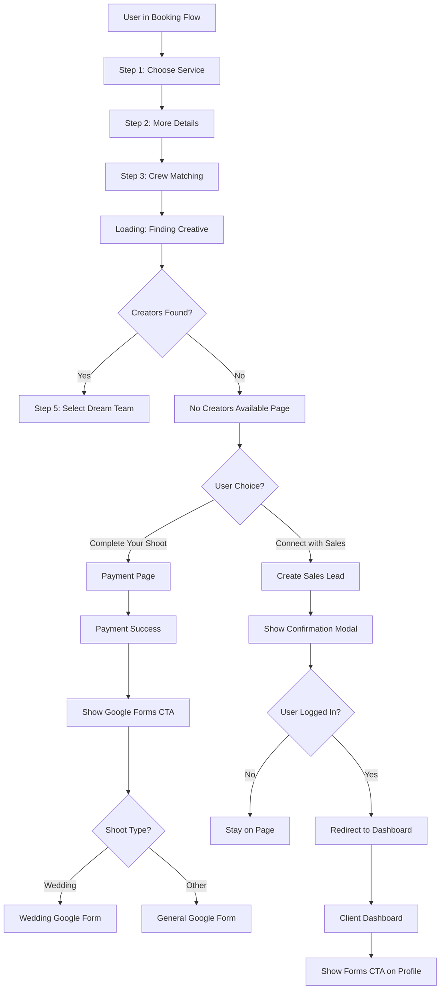
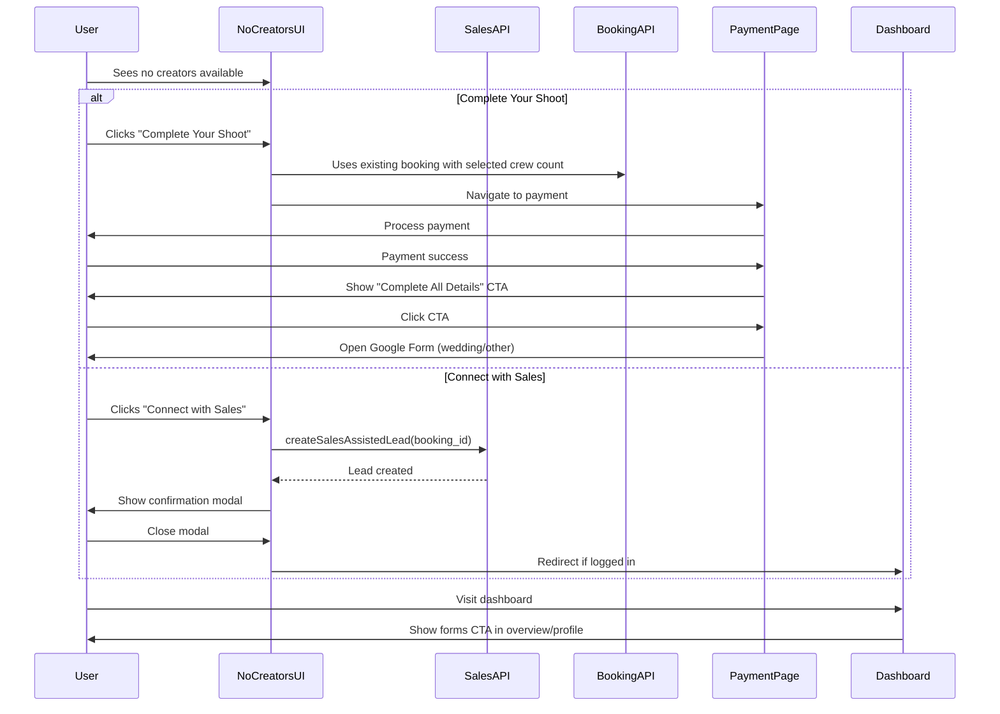

# No Creators Available Flow Enhancement

## Overview

When no creators are available during booking, users will see two CTAs: "Complete Your Shoot" (proceed with payment for selected crew size) and "Connect with Sales" (trigger sales assistance). After payment completion, users will see a CTA to fill out detailed shoot information via Google Forms (wedding vs non-wedding), with the same CTA persisted on the client dashboard.

## Architecture

### Flow Diagram



### Data Flow



## Implementation Details

### 1. No Creators Available Page Updates

**File:** `[components/book-a-shoot/v3/V3SelectDreamTeam.tsx](components/book-a-shoot/v3/V3SelectDreamTeam.tsx)`

**Changes:**

- Replace the single "Connect with Sales Expert" button (line 274-279) with two new CTAs:
  - **"Complete Your Shoot"** (primary, beige button) - triggers `onNext()` to proceed to payment
  - **"Connect with Sales"** (secondary, outline button) - creates sales lead via API
- Add state for sales confirmation modal
- Import and use `useCreateSalesAssistedLeadMutation` from sales API
- Import `useAuth` to check login status
- Import `useRouter` for navigation after sales contact
- Pass booking data (booking_id, guest_email, user_id) from props or context

**Props needed:**

- Access to booking data (booking_id, guest_email, user_id, client_name)
- Add these to component props if not already available

**Modal Implementation:**

- Create simple confirmation dialog using `Dialog` from `[components/ui/dialog.tsx](components/ui/dialog.tsx)`
- Show message: "Thank you for your interest! Our sales team will reach out to you shortly."
- On close: Check `isAuthenticated` from `useAuth()`, redirect to `/affiliate/dashboard` if logged in, otherwise stay on page

### 2. Payment Success & Google Forms CTA

**File:** `[app/search-results/[creatorId]/payment/components/BookingSumaryModal.tsx](app/search-results/[creatorId]/payment/components/BookingSumaryModal.tsx)`

**Changes:**

- Add new prop: `shootType: string` (passed from parent)
- Add new button above existing action buttons (around line 129):
  - Text: "Complete All The Details For Your Shoot"
  - Style: Prominent CTA (similar styling to existing buttons)
  - Click handler: Opens Google Form URL based on shoot type
- Form URL logic:
  ```typescript
  const formUrl =
    shootType === "wedding"
      ? "https://docs.google.com/forms/d/e/1FAIpQLSdg9VNPGWzS0-48TtYCfejktfl2j3Hl4sAD4HSkUoQIMP9WQA/viewform"
      : "https://docs.google.com/forms/d/e/1FAIpQLSeYWPQXfFBqzt4FHVy6ccrS4WVbjFLHJQeIu56rj_zEinGGfQ/viewform";
  ```
- Attempt URL pre-filling with booking data if possible:
  - Guest email
  - Shoot type
  - Event date
  - Location
  - Use Google Forms URL parameter format (e.g., `?entry.123456=value&entry.789012=value`)
  - Note: Entry IDs need to be determined by inspecting form fields

**File:** `[app/search-results/[creatorId]/payment/page.tsx](app/search-results/[creatorId]/payment/page.tsx)`

**Changes:**

- Pass `shootType` from booking data to `BookingSummaryModal` (around line 434-449)
- Extract shoot type from `guestBooking` state or booking API response
- Update modal props to include shoot type

### 3. Client Dashboard Forms CTA

**File:** `[app/affiliate/dashboard/page.tsx](app/affiliate/dashboard/page.tsx)`

**Changes:**

- Add Google Forms CTA to the dashboard overview tab (lines 446-609)
- Place in prominent location, potentially:
  - As a banner/card at the top of overview section
  - Or within the profile/overview stats area
- Component structure:
  ```typescript
  <div className="bg-[#E8D1AB]/10 border border-[#E8D1AB]/20 rounded-xl p-6">
    <h3 className="text-white font-semibold mb-2">Complete Your Shoot Details</h3>
    <p className="text-white/60 text-sm mb-4">
      Help us prepare better by filling out detailed information about your shoot
    </p>
    <Button className="bg-[#E8D1AB] hover:bg-[#dcb98a]">
      Fill Out Shoot Details
    </Button>
  </div>
  ```
- Show this for bookings where shoot details haven't been completed
- Determine form URL based on shoot type from booking data
- Consider showing this per booking (iterate through user's active bookings)

**Data Requirements:**

- Access to user's bookings with shoot type information
- Potentially add tracking flag in backend to know if form has been completed

### 4. Backend Considerations (if needed)

**Potential Changes:**

- May need to track whether Google Form has been completed per booking
- Add optional field to `stream_project_booking` table: `details_form_completed` (boolean, default false)
- This would allow hiding the dashboard CTA once form is filled
- Not critical for initial implementation - can show CTA for all recent bookings

### 5. Sales Lead Integration

**API Usage:**

- Use `createSalesAssistedLead` mutation from `[lib/redux/features/sales/salesApi.ts](lib/redux/features/sales/salesApi.ts)`
- Endpoint: `POST /v1/sales/leads/contact-sales`
- Required data:
  ```typescript
  {
    booking_id: number,
    user_id?: number,
    guest_email?: string,
    client_name?: string
  }
  ```
- This automatically creates a sales lead with status `in_progress_sales_assisted`
- Sales team can view this in admin dashboard at `[app/admin/sales-representative/page.tsx](app/admin/sales-representative/page.tsx)`

## Technical Notes

### Google Forms URL Pre-filling

- Google Forms supports pre-filling via URL parameters
- Format: `?entry.FIELD_ID=value&entry.ANOTHER_ID=value`
- To get field IDs:
  1. Open form in edit mode
  2. Click on a field
  3. Inspect the input element - ID will be in format `entry.123456`
- URL encode values using `encodeURIComponent()`
- Example:
  ```typescript
  const prefillUrl = `${baseFormUrl}?entry.123456=${encodeURIComponent(email)}&entry.789012=${encodeURIComponent(shootType)}`;
  ```

### Payment Flow with No Creators

- When user clicks "Complete Your Shoot", existing booking data is preserved
- Payment calculation should use the crew size selected in Step 2 (teamIncluded, crewCount)
- Quote calculation continues as normal with default pricing
- No creator assignment happens until later (sales team or manual matching)

### Authentication Check

- Use `useAuth()` hook from `[lib/hooks/useAuth.ts](lib/hooks/useAuth.ts)`
- Returns `{ isAuthenticated, user }`
- Check `isAuthenticated` before redirecting to dashboard
- For guest bookings, user will not be logged in

## File Changes Summary

### Frontend Files to Modify

1. `[components/book-a-shoot/v3/V3SelectDreamTeam.tsx](components/book-a-shoot/v3/V3SelectDreamTeam.tsx)` - Add dual CTA and sales modal
2. `[app/search-results/[creatorId]/payment/components/BookingSumaryModal.tsx](app/search-results/[creatorId]/payment/components/BookingSumaryModal.tsx)` - Add Google Forms CTA
3. `[app/search-results/[creatorId]/payment/page.tsx](app/search-results/[creatorId]/payment/page.tsx)` - Pass shoot type to modal
4. `[app/affiliate/dashboard/page.tsx](app/affiliate/dashboard/page.tsx)` - Add persistent forms CTA

### Backend Files (Optional)

- `[src/models/stream_project_booking.js](../revure-v2-backend/src/models/stream_project_booking.js)` - Consider adding `details_form_completed` field
- No changes needed to sales API - already implemented

### Reusable Components

- Use existing `Dialog` from `[components/ui/dialog.tsx](components/ui/dialog.tsx)`
- Use existing `Button` from `[components/ui/button.tsx](components/ui/button.tsx)`
- Follow existing modal patterns from `[components/affiliate/AffiliateStartConversationModal.tsx](components/affiliate/AffiliateStartConversationModal.tsx)`

## Testing Checklist

- No creators scenario shows both CTAs with correct styling
- "Complete Your Shoot" proceeds to payment with correct crew count pricing
- "Connect with Sales" creates sales lead in database
- Sales confirmation modal appears and closes correctly
- Logged-in users redirect to dashboard after sales contact
- Guest users stay on page after sales contact
- Payment success shows Google Forms CTA
- Wedding bookings link to wedding form
- Non-wedding bookings link to general form
- Google Forms open in new tab (use `target="_blank"`)
- URL pre-filling works (if implemented)
- Dashboard shows forms CTA
- Dashboard CTA opens correct form based on shoot type
- Sales leads appear in admin dashboard
