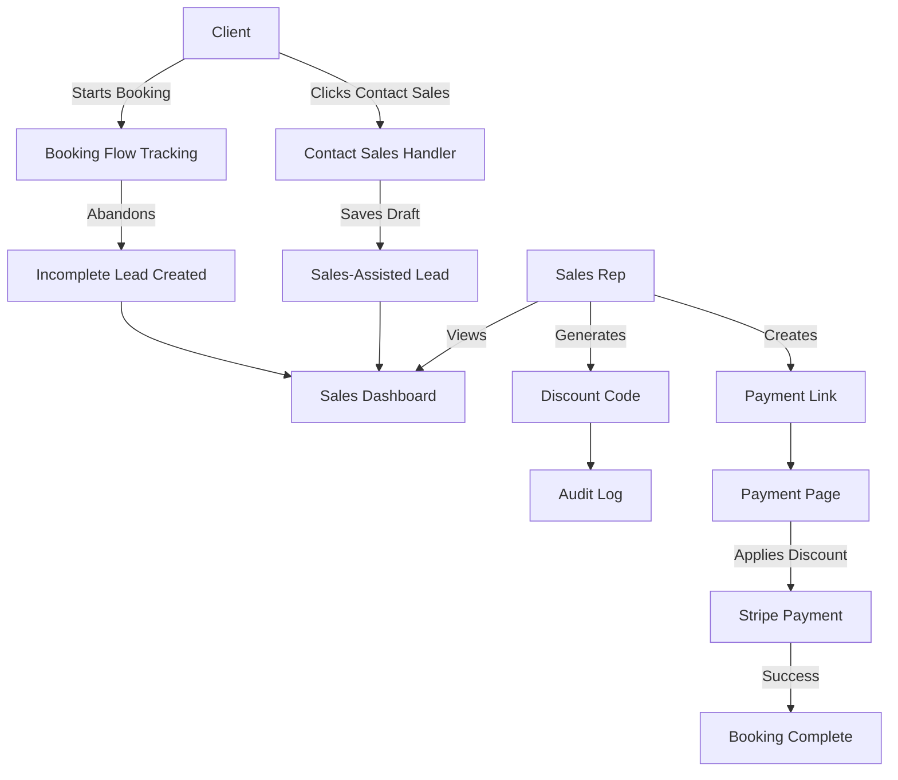
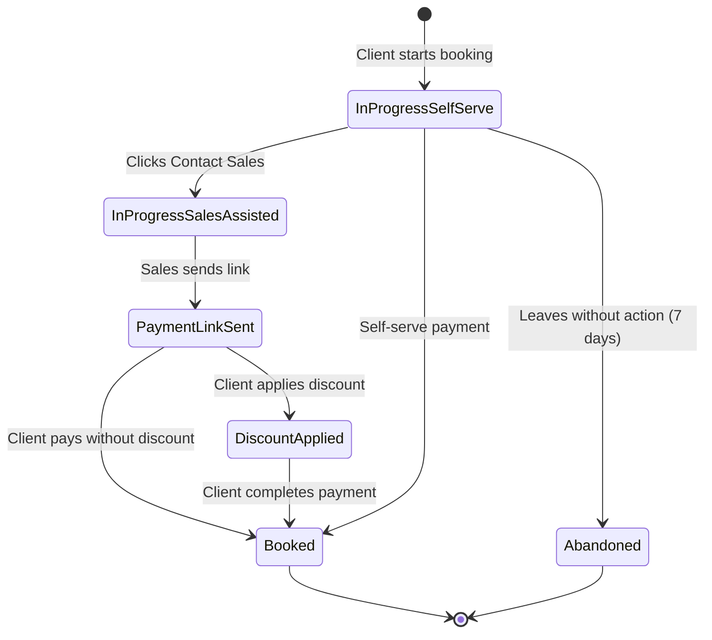

# Sales-Driven Discount & Payment Links Implementation Plan

## System Overview

We'll build a comprehensive sales system that captures two types of leads (incomplete self-serve and sales-assisted bookings), provides a dedicated sales dashboard, enables discount code and payment link generation, and tracks the complete sales funnel.

## Architecture



## Database Schema Changes

### 1. New Tables

#### `sales_leads` Table

```sql
CREATE TABLE sales_leads (
  lead_id INT PRIMARY KEY AUTO_INCREMENT,
  booking_id INT NULL REFERENCES stream_project_booking(stream_project_booking_id),
  user_id INT NULL REFERENCES users(id),
  guest_email VARCHAR(255) NULL,
  client_name VARCHAR(255) NULL,
  lead_type ENUM('self_serve', 'sales_assisted') NOT NULL,
  lead_status ENUM('in_progress_self_serve', 'in_progress_sales_assisted', 'payment_link_sent', 'discount_applied', 'booked', 'abandoned') NOT NULL DEFAULT 'in_progress_self_serve',
  assigned_sales_rep_id INT NULL REFERENCES users(id),
  last_activity_at TIMESTAMP DEFAULT CURRENT_TIMESTAMP ON UPDATE CURRENT_TIMESTAMP,
  contacted_sales_at TIMESTAMP NULL,
  created_at TIMESTAMP DEFAULT CURRENT_TIMESTAMP,
  updated_at TIMESTAMP DEFAULT CURRENT_TIMESTAMP ON UPDATE CURRENT_TIMESTAMP,
  INDEX idx_lead_status (lead_status),
  INDEX idx_assigned_rep (assigned_sales_rep_id),
  INDEX idx_booking (booking_id)
);
```

#### `discount_codes` Table

```sql
CREATE TABLE discount_codes (
  discount_code_id INT PRIMARY KEY AUTO_INCREMENT,
  code VARCHAR(50) UNIQUE NOT NULL,
  lead_id INT NULL REFERENCES sales_leads(lead_id),
  booking_id INT NULL REFERENCES stream_project_booking(stream_project_booking_id),
  discount_type ENUM('percentage', 'fixed_amount') NOT NULL DEFAULT 'percentage',
  discount_value DECIMAL(10,2) NOT NULL,
  usage_type ENUM('one_time', 'multi_use') NOT NULL DEFAULT 'one_time',
  max_uses INT NULL,
  current_uses INT DEFAULT 0,
  expires_at TIMESTAMP NULL,
  created_by_user_id INT NOT NULL REFERENCES users(id),
  is_active BOOLEAN DEFAULT 1,
  created_at TIMESTAMP DEFAULT CURRENT_TIMESTAMP,
  updated_at TIMESTAMP DEFAULT CURRENT_TIMESTAMP ON UPDATE CURRENT_TIMESTAMP,
  INDEX idx_code (code),
  INDEX idx_lead (lead_id),
  INDEX idx_active (is_active)
);
```

#### `discount_code_usage` Table (Audit Log)

```sql
CREATE TABLE discount_code_usage (
  usage_id INT PRIMARY KEY AUTO_INCREMENT,
  discount_code_id INT NOT NULL REFERENCES discount_codes(discount_code_id),
  booking_id INT NULL REFERENCES stream_project_booking(stream_project_booking_id),
  user_id INT NULL REFERENCES users(id),
  guest_email VARCHAR(255) NULL,
  discount_amount DECIMAL(10,2) NOT NULL,
  used_at TIMESTAMP DEFAULT CURRENT_TIMESTAMP,
  INDEX idx_discount_code (discount_code_id),
  INDEX idx_booking (booking_id)
);
```

#### `payment_links` Table

```sql
CREATE TABLE payment_links (
  payment_link_id INT PRIMARY KEY AUTO_INCREMENT,
  link_token VARCHAR(100) UNIQUE NOT NULL,
  lead_id INT NULL REFERENCES sales_leads(lead_id),
  booking_id INT NOT NULL REFERENCES stream_project_booking(stream_project_booking_id),
  discount_code_id INT NULL REFERENCES discount_codes(discount_code_id),
  created_by_user_id INT NOT NULL REFERENCES users(id),
  expires_at TIMESTAMP NOT NULL,
  is_used BOOLEAN DEFAULT 0,
  used_at TIMESTAMP NULL,
  created_at TIMESTAMP DEFAULT CURRENT_TIMESTAMP,
  INDEX idx_token (link_token),
  INDEX idx_lead (lead_id),
  INDEX idx_booking (booking_id)
);
```

### 2. Existing Table Modifications

#### Update `stream_project_booking`

```sql
ALTER TABLE stream_project_booking
ADD COLUMN lead_status ENUM('in_progress_self_serve', 'in_progress_sales_assisted', 'payment_link_sent', 'discount_applied', 'booked', 'abandoned') NULL,
ADD COLUMN sales_assisted BOOLEAN DEFAULT 0,
ADD COLUMN tracking_started_at TIMESTAMP NULL,
ADD COLUMN payment_page_reached_at TIMESTAMP NULL,
ADD INDEX idx_lead_status (lead_status);
```

#### Update `quotes`

```sql
ALTER TABLE quotes
ADD COLUMN discount_code_id INT NULL REFERENCES discount_codes(discount_code_id),
ADD COLUMN applied_discount_value DECIMAL(10,2) NULL,
ADD INDEX idx_discount_code (discount_code_id);
```

## Backend Implementation

### Phase 1: Database Models & Migrations

**Files to create:**

- [`/Users/amrik/Documents/revure/revure-v2-backend/migrations/20260121_01_create_sales_system_tables.sql`](migrations/20260121_01_create_sales_system_tables.sql)
- [`/Users/amrik/Documents/revure/revure-v2-backend/src/models/sales_leads.js`](src/models/sales_leads.js)
- [`/Users/amrik/Documents/revure/revure-v2-backend/src/models/discount_codes.js`](src/models/discount_codes.js)
- [`/Users/amrik/Documents/revure/revure-v2-backend/src/models/discount_code_usage.js`](src/models/discount_code_usage.js)
- [`/Users/amrik/Documents/revure/revure-v2-backend/src/models/payment_links.js`](src/models/payment_links.js)

Update [`/Users/amrik/Documents/revure/revure-v2-backend/src/models/init-models.js`](src/models/init-models.js) to include new models and relationships.

### Phase 2: Lead Tracking System

**Files to create/update:**

1.  **Lead Capture Controller** - [`/Users/amrik/Documents/revure/revure-v2-backend/src/controllers/sales-leads.controller.js`](src/controllers/sales-leads.controller.js)

                                                - `trackBookingStart` - Track when client starts booking
                                                - `trackPaymentPageReached` - Track when client reaches payment page
                                                - `createSalesAssistedLead` - Create lead when "Contact Sales" clicked
                                                - `getLeads` - Get all leads with filters (status, type, assigned rep)
                                                - `getLeadById` - Get detailed lead information
                                                - `assignLead` - Assign/reassign lead to sales rep
                                                - `updateLeadStatus` - Update lead status

2.  **Update Booking Controllers** - Modify existing:

                                                - [`/Users/amrik/Documents/revure/revure-v2-backend/src/controllers/bookings.controller.js`](src/controllers/bookings.controller.js)
                                                - [`/Users/amrik/Documents/revure/revure-v2-backend/src/controllers/guest-bookings.controller.js`](src/controllers/guest-bookings.controller.js)

Add lead tracking calls:

                                                - In `createBooking` and `createGuestBooking`: Call `trackBookingStart`
                                                - On payment intent creation: Call `trackPaymentPageReached`

### Phase 3: Discount Code System

**Files to create:**

1.  **Discount Controller** - [`/Users/amrik/Documents/revure/revure-v2-backend/src/controllers/discounts.controller.js`](src/controllers/discounts.controller.js)

    ```javascript
    // Key functions:
    -generateDiscountCode(req, res) - // Sales rep generates code
      validateDiscountCode(req, res) - // Client validates on payment page
      applyDiscountCode(req, res) - // Apply to quote/booking
      getDiscountCodeDetails(req, res) -
      deactivateDiscountCode(req, res) -
      getDiscountCodeUsageHistory(req, res);
    ```

2.  **Discount Service** - [`/Users/amrik/Documents/revure/revure-v2-backend/src/services/discount.service.js`](src/services/discount.service.js)

    ```javascript
    // Utility functions:
    -generateUniqueCode() - // Generate unique 8-char code (e.g., REVURE10)
      validateCodeFormat(code) -
      checkCodeAvailability(code) -
      calculateDiscountAmount(subtotal, discountCode) -
      incrementUsageCount(discountCodeId) -
      logUsage(discountCodeId, bookingId, userId, amount);
    ```

3.  **Update Pricing Controller** - Modify [`/Users/amrik/Documents/revure/revure-v2-backend/src/controllers/pricing.controller.js`](src/controllers/pricing.controller.js)

                                                - Add discount code parameter to quote generation
                                                - Recalculate pricing with discount applied
                                                - Store discount_code_id in quotes table

### Phase 4: Payment Link System

**Files to create:**

1.  **Payment Links Controller** - [`/Users/amrik/Documents/revure/revure-v2-backend/src/controllers/payment-links.controller.js`](src/controllers/payment-links.controller.js)

    ```javascript
    // Key functions:
    -generatePaymentLink(req, res) - // Sales rep generates link
      getPaymentLinkDetails(req, res) - // Client opens link
      validatePaymentLink(req, res) - // Check if link is valid/expired
      markLinkAsUsed(req, res); // After successful payment
    ```

2.  **Payment Links Service** - [`/Users/amrik/Documents/revure/revure-v2-backend/src/services/payment-links.service.js`](src/services/payment-links.service.js)

    ```javascript
    // Utility functions:
    -generateLinkToken() - // Generate unique token
      buildPaymentUrl(token, discountCode) - // Build full URL
      checkLinkExpiration(linkToken) -
      getDefaultExpiration(); // 72 hours from now
    ```

3.  **Update Payment Controller** - Modify [`/Users/amrik/Documents/revure/revure-v2-backend/src/controllers/payments.controller.js`](src/controllers/payments.controller.js)

                                                - Add payment link validation before creating payment intent
                                                - Update lead status to "payment_link_sent" when link is used
                                                - Update to "booked" on successful payment

### Phase 5: Sales Dashboard API

**Files to create:**

1. **Sales Dashboard Controller** - [`/Users/amrik/Documents/revure/revure-v2-backend/src/controllers/sales-dashboard.controller.js`](src/controllers/sales-dashboard.controller.js)

   ```javascript
   // Key functions:
   -getDashboardStats(req, res) - // Overview stats
     getLeadsList(req, res) - // Paginated leads with filters
     getLeadDetails(req, res) - // Full lead details
     getSalesRepLeads(req, res) - // Leads for specific rep
     getSalesRepStats(req, res); // Rep performance metrics
   ```

2. **Sales Routes** - [`/Users/amrik/Documents/revure/revure-v2-backend/src/routes/sales.routes.js`](src/routes/sales.routes.js)

   ```javascript
   // Route structure:
   POST /v1/sales/leads/track-start // Track booking start
   POST /v1/sales/leads/track-payment-page // Track payment page reached
   POST /v1/sales/leads/contact-sales // Create sales-assisted lead
   GET /v1/sales/leads // Get all leads (with filters)
   GET /v1/sales/leads/:id // Get lead details
   PUT /v1/sales/leads/:id/assign // Assign lead
   PUT /v1/sales/leads/:id/status // Update status

   POST /v1/sales/discount-codes // Generate discount code
   GET /v1/sales/discount-codes/:code/validate // Validate code
   POST /v1/sales/discount-codes/:code/apply // Apply to booking
   GET /v1/sales/discount-codes/:id // Get code details
   DELETE /v1/sales/discount-codes/:id // Deactivate code

   POST /v1/sales/payment-links // Generate payment link
   GET /v1/sales/payment-links/:token // Get link details

   GET /v1/sales/dashboard/stats // Dashboard statistics
   GET /v1/sales/dashboard/leads // Dashboard leads list
   ```

### Phase 6: Authentication & Authorization

**Files to update:**

1. **Auth Middleware** - Update [`/Users/amrik/Documents/revure/revure-v2-backend/src/middleware/auth.middleware.js`](src/middleware/auth.middleware.js)

   ```javascript
   // Add new middleware:
   -requireSalesRep() - // Verify user is sales rep
     requireSalesRepOrAdmin(); // Verify user is sales rep or admin
   ```

2. **Routes Index** - Update [`/Users/amrik/Documents/revure/revure-v2-backend/src/routes/index.js`](src/routes/index.js)
   ```javascript
   router.use("/sales", requireSalesRepOrAdmin, require("./sales.routes"));
   ```

## Frontend Implementation

### Phase 1: Redux API Setup

**Files to create:**

1.  **Sales API** - [`/Users/amrik/Documents/revure/revure-v2-landing/lib/redux/features/sales/salesApi.ts`](lib/redux/features/sales/salesApi.ts)

    ```typescript
    // RTK Query endpoints:
    -getLeads -
      getLeadById -
      assignLead -
      updateLeadStatus -
      generateDiscountCode -
      validateDiscountCode -
      generatePaymentLink -
      getDashboardStats;
    ```

2.  **Update Store** - Modify [`/Users/amrik/Documents/revure/revure-v2-landing/lib/redux/store.ts`](lib/redux/store.ts)

                                                - Add salesApi reducer

### Phase 2: Sales Dashboard UI

**Files to create:**

1.  **Sales Layout** - [`/Users/amrik/Documents/revure/revure-v2-landing/app/sales/layout.tsx`](app/sales/layout.tsx)

                                                - Similar structure to admin layout
                                                - Sales-specific sidebar navigation

2.  **Sales Sidebar** - [`/Users/amrik/Documents/revure/revure-v2-landing/components/sales/Sidebar.tsx`](components/sales/Sidebar.tsx)

    ```tsx
    // Menu items:
    - Dashboard (overview stats)
    - Leads (lead list)
    - My Leads (assigned to current rep)
    - Discount Codes
    - Payment Links
    ```

3.  **Sales Dashboard Page** - [`/Users/amrik/Documents/revure/revure-v2-landing/app/sales/dashboard/page.tsx`](app/sales/dashboard/page.tsx)

                                                - Overview statistics cards
                                                - Recent leads table
                                                - Performance metrics charts

4.  **Leads List Page** - [`/Users/amrik/Documents/revure/revure-v2-landing/app/sales/leads/page.tsx`](app/sales/leads/page.tsx)

                                                - Filterable table (status, type, assigned rep)
                                                - Search by client name/email
                                                - Actions: View Details, Assign, Generate Link

5.  **Lead Detail Page** - [`/Users/amrik/Documents/revure/revure-v2-landing/app/sales/leads/[id]/page.tsx`](app/sales/leads/[id]/page.tsx)

                                                - Client information section
                                                - Booking details section
                                                - Timeline/activity log
                                                - Actions panel with:
                                                                                - Generate Discount Code button
                                                                                - Generate Payment Link button
                                                                                - Update Status dropdown
                                                                                - Assign to Rep dropdown

### Phase 3: Sales Components

**Files to create:**

1.  **Lead Status Badge** - [`/Users/amrik/Documents/revure/revure-v2-landing/components/sales/LeadStatusBadge.tsx`](components/sales/LeadStatusBadge.tsx)

                                                - Color-coded status badges

2.  **Leads Table** - [`/Users/amrik/Documents/revure/revure-v2-landing/components/sales/LeadsTable.tsx`](components/sales/LeadsTable.tsx)

                                                - Columns: Client Name, Email, Lead Type, Status, Last Activity, Assigned Rep, Actions
                                                - Sortable columns
                                                - Pagination

3.  **Generate Discount Modal** - [`/Users/amrik/Documents/revure/revure-v2-landing/components/sales/GenerateDiscountModal.tsx`](components/sales/GenerateDiscountModal.tsx)

    ```tsx
    // Form fields:
    - Discount Type (percentage/fixed)
    - Discount Value (number input)
    - Usage Type (one-time/multi-use)
    - Max Uses (if multi-use)
    - Expiration Date (optional)
    - Generate button
    // Output:
    - Display generated code
    - Copy to clipboard button
    ```

4.  **Generate Payment Link Modal** - [`/Users/amrik/Documents/revure/revure-v2-landing/components/sales/GeneratePaymentLinkModal.tsx`](components/sales/GeneratePaymentLinkModal.tsx)

    ```tsx
    // Options:
    - Link existing discount code (dropdown)
    - Generate new discount code (toggle)
    - Expiration time (default 72 hours)
    - Generate button
    // Output:
    - Display payment link URL
    - Copy to clipboard button
    - Email to client button
    ```

5.  **Assign Lead Modal** - [`/Users/amrik/Documents/revure/revure-v2-landing/components/sales/AssignLeadModal.tsx`](components/sales/AssignLeadModal.tsx)

                                                - Sales rep dropdown
                                                - Assign/Reassign button

### Phase 4: Booking Flow Tracking

**Files to update:**

1. **Booking Modal/Flow** - Update [`/Users/amrik/Documents/revure/revure-v2-landing/app/book-a-shoot/page.tsx`](app/book-a-shoot/page.tsx) and search results booking

   ```typescript
   // Add tracking calls:
   - On mount/first interaction: Call trackBookingStart API
   - Store temporary booking ID in state/localStorage
   - Pass booking ID through the flow
   ```

2. **Contact Sales Handler** - Update [`/Users/amrik/Documents/revure/revure-v2-landing/app/search-results/payment/page.tsx`](app/search-results/payment/page.tsx)
   ```typescript
   // Modify "Talk To Someone" button:
   const handleContactSales = async () => {
     // 1. Call API to save booking as draft
     // 2. Create sales-assisted lead
     // 3. Show success modal: "Sales team will contact you"
     // 4. Track event in analytics
   };
   ```

### Phase 5: Payment Page Discount Application

**Files to update:**

1. **Payment Page Enhancement** - Update [`/Users/amrik/Documents/revure/revure-v2-landing/app/search-results/payment/page.tsx`](app/search-results/payment/page.tsx)

   ```typescript
   // Add functionality:
   - Check URL for discount code parameter (?discount=CODE)
   - If present, auto-validate and apply
   - Add discount code input field (like referral code)
   - Real-time validation with visual feedback
   - Show discount amount in pricing breakdown
   - Apply discount before creating payment intent
   ```

2. **Payment Link Landing** - Create [`/Users/amrik/Documents/revure/revure-v2-landing/app/payment-link/[token]/page.tsx`](app/payment-link/[token]/page.tsx)
   ```typescript
   // Flow:
   - Fetch payment link details by token
   - Validate link (not expired, not used)
   - Load booking details
   - Auto-apply discount code if linked
   - Redirect to payment page with pre-filled data
   ```

### Phase 6: Types & Utilities

**Files to create:**

1. **Types** - [`/Users/amrik/Documents/revure/revure-v2-landing/types/sales.ts`](types/sales.ts)

   ```typescript
   export interface SalesLead {
     lead_id: number;
     booking_id: number;
     client_name: string;
     email: string;
     lead_type: "self_serve" | "sales_assisted";
     lead_status: LeadStatus;
     assigned_sales_rep_id?: number;
     assigned_rep_name?: string;
     last_activity_at: string;
     created_at: string;
   }

   export type LeadStatus =
     | "in_progress_self_serve"
     | "in_progress_sales_assisted"
     | "payment_link_sent"
     | "discount_applied"
     | "booked"
     | "abandoned";

   export interface DiscountCode {
     discount_code_id: number;
     code: string;
     discount_type: "percentage" | "fixed_amount";
     discount_value: number;
     usage_type: "one_time" | "multi_use";
     max_uses?: number;
     current_uses: number;
     expires_at?: string;
     is_active: boolean;
   }

   export interface PaymentLink {
     payment_link_id: number;
     link_token: string;
     url: string;
     booking_id: number;
     discount_code?: DiscountCode;
     expires_at: string;
     is_used: boolean;
   }
   ```

2. **Discount Utilities** - [`/Users/amrik/Documents/revure/revure-v2-landing/lib/utils/discountHelpers.ts`](lib/utils/discountHelpers.ts)
   ```typescript
   -calculateDiscount(subtotal, discountCode) -
     formatDiscountCode(code) -
     isDiscountCodeValid(code) -
     getDiscountDescription(discountCode);
   ```

## Lead Status Flow



## Auto-Assignment Logic

Implement round-robin assignment in [`/Users/amrik/Documents/revure/revure-v2-backend/src/services/lead-assignment.service.js`](src/services/lead-assignment.service.js):

```javascript
async function autoAssignLead(leadId) {
  // 1. Get all active sales reps
  const salesReps = await users.findAll({
    where: { user_type: 2, is_active: 1 }, // user_type 2 = sales_rep
  });

  // 2. Count leads per rep in last 24 hours
  const leadCounts = await sales_leads.findAll({
    attributes: [
      "assigned_sales_rep_id",
      [sequelize.fn("COUNT", sequelize.col("lead_id")), "count"],
    ],
    where: {
      created_at: { [Op.gte]: new Date(Date.now() - 24 * 60 * 60 * 1000) },
    },
    group: ["assigned_sales_rep_id"],
  });

  // 3. Assign to rep with fewest leads
  const repWithFewest = findRepWithFewestLeads(salesReps, leadCounts);

  // 4. Update lead
  await sales_leads.update(
    { assigned_sales_rep_id: repWithFewest.id },
    { where: { lead_id: leadId } }
  );
}
```

## Testing Checklist

### Backend Tests

- [ ] Lead creation for both types
- [ ] Lead status transitions
- [ ] Discount code generation (unique codes)
- [ ] Discount code validation (expiry, usage limits)
- [ ] Discount application to quotes
- [ ] Payment link generation
- [ ] Payment link expiration handling
- [ ] Auto-assignment logic
- [ ] Manual reassignment
- [ ] Audit log creation

### Frontend Tests

- [ ] Sales dashboard loads with correct data
- [ ] Lead filtering and search
- [ ] Discount code modal validation
- [ ] Payment link modal generation
- [ ] Payment page discount application
- [ ] Payment link redemption
- [ ] Contact Sales flow
- [ ] Booking tracking

### Integration Tests

- [ ] Complete flow: Self-serve → Abandoned → Sales converts
- [ ] Complete flow: Contact Sales → Payment Link → Paid
- [ ] Discount code usage across multiple bookings (multi-use)
- [ ] Expired link handling
- [ ] Expired discount code handling

## Environment Variables

Add to `.env`:

```
# Sales System
PAYMENT_LINK_DEFAULT_EXPIRY_HOURS=72
DISCOUNT_CODE_LENGTH=8
LEAD_ABANDONMENT_DAYS=7
SALES_AUTO_ASSIGNMENT=true
```

## Security Considerations

1. **Payment Links**: Use cryptographically secure tokens (32+ characters)
2. **Discount Codes**: Rate limit validation attempts
3. **Authorization**: Strict checks - only sales reps/admins can access sales routes
4. **Audit Logging**: Log all discount code generation and usage
5. **Link Expiration**: Enforce server-side expiration checks
6. **One-time Use**: Mark links as used immediately after payment

## Performance Optimizations

1. **Indexing**: All foreign keys and frequently queried columns indexed
2. **Caching**: Cache active discount codes (Redis if available)
3. **Pagination**: All lead lists paginated (default 20 per page)
4. **Eager Loading**: Include related data to avoid N+1 queries
5. **Database**: Use database transactions for payment + discount application

## Future Enhancements (Post-MVP)

- Email notifications to sales reps on new leads
- SMS notifications to clients with payment links
- Advanced discount rules (stacking, category-specific)
- Sales performance analytics dashboard
- CRM integration (Salesforce, HubSpot)
- Automated follow-up sequences
- Lead scoring system
- Bulk discount code generation
- API webhooks for lead events
